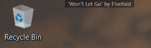

# Peekify (formerly SpotiPeek)

No longer maintained -- Archiving repo on 8/20/2025.

----

Small Windows WPF application that displays the name of the song and artist currently playing on the local Spotify app. Whenever the track changes, it also shows a small version of the current track's album art for five seconds. 

This app is most useful for anyone who often plays playlists of music they're not familiar with and want an easy way to see the track's name and artist with just a glance of the eye.

Credits:
* Uses the [SpotifyAPI-NET](https://github.com/JohnnyCrazy/SpotifyAPI-NET) library to interact with the local Spotify application.
* Icon comes from [here](http://www.iconarchive.com/show/stark-icons-by-fruityth1ng/Spotify-GB-icon.html) and was created by [Herman van Boeijen](http://www.iconarchive.com/artist/fruityth1ng.html). 
